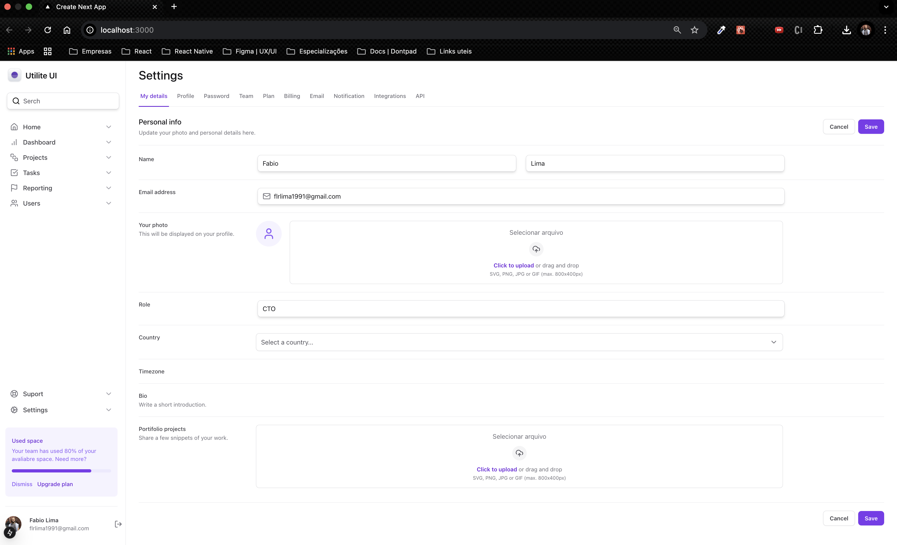

<h1 align="center"> Tailwind treinamento </h1>

Programa exclusivo, promovido pela Rocketseat para ensino de tecnologias WEB.  

  <a href="#-tecnologias">Tecnologias</a>&nbsp;&nbsp;&nbsp;|&nbsp;&nbsp;&nbsp;
  <a href="#-projeto">Projeto</a>&nbsp;&nbsp;&nbsp;|&nbsp;&nbsp;&nbsp;
  <a href="#-layout">Layout</a>&nbsp;&nbsp;&nbsp;|&nbsp;&nbsp;&nbsp;
  <a href="#memo-licença">Licença</a>

  

 

  

## 🚀 Tecnologias

Esse projeto foi desenvolvido com as seguintes tecnologias:

- Next
- React
- HTML, Tailwind CSS
- JavaScript/Typescript
- Git e Github
- Figma

## 💻 Projeto

Objetivo deste progeto foi firmar e aprofundar conhecimentos do tailwindcss.

## 🔖 Layout

Você pode visualizar o layout do projeto através das imagens disponibilizadas por aqui, pois o figma do projeto não está mais acessível e você não poderá acessá-lo.

## :memo: Licença

Esse projeto está sob a licença MIT.

---
